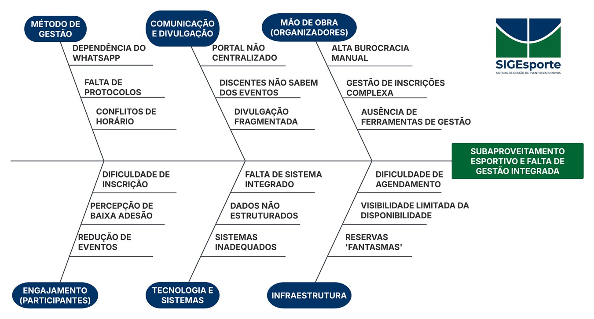
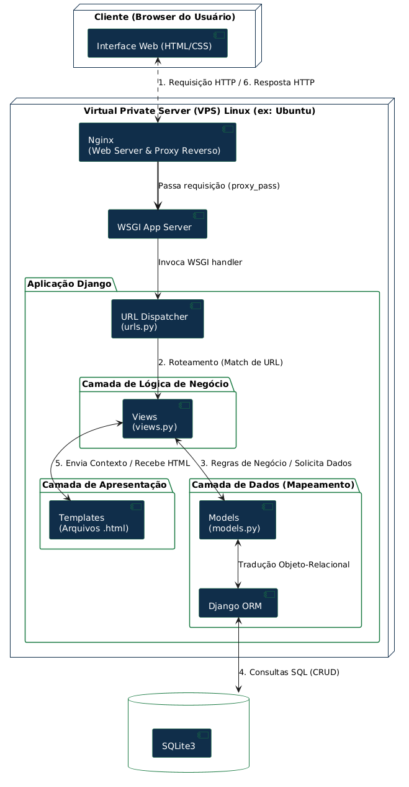
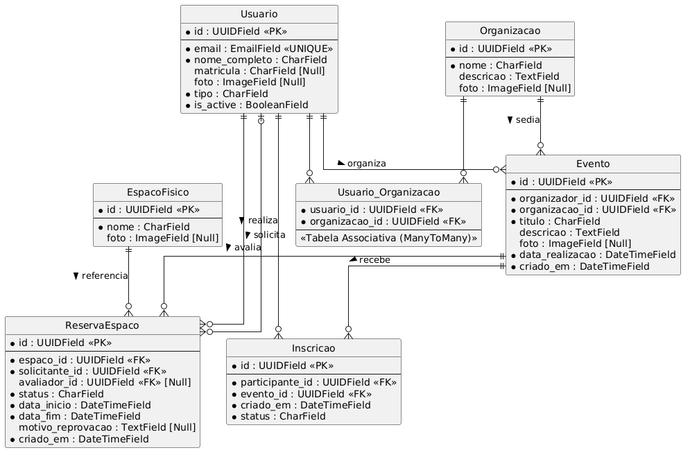
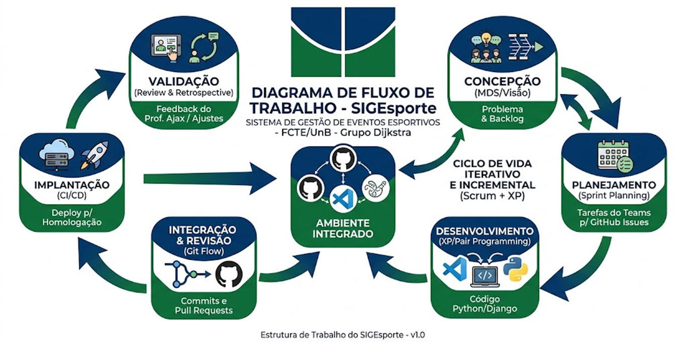

# Apresentação do Projeto

<p align="center">
  
</p>

**SIGEsporte — Sistema de Gerenciamento Esportivo**

Plataforma web para organização de eventos esportivos, reserva de espaços físicos e inscrição de alunos nas atividades do campus FCTE/UnB.

Projeto desenvolvido pelo grupo **Dijkstra** na disciplina **Métodos de Desenvolvimento de Software (MDS)** — FGA0138, Universidade de Brasília, sob orientação do professor **Ricardo Ajax**.

| | |
| :--- | :--- |
| 🚀 **Sistema em produção** | [sigesporte.duat.site](https://sigesporte.duat.site/) |
| 📦 **Repositório** | [github.com/FGA0138-MDS-Ajax/2026.1-T01-Dijkstra](https://github.com/FGA0138-MDS-Ajax/2026.1-T01-Dijkstra) |
| 📚 **Documentação** | [fga0138-mds-ajax.github.io/2026.1-T01-Dijkstra](https://fga0138-mds-ajax.github.io/2026.1-T01-Dijkstra/) |

---

## 1. O Problema

O campus da FCTE dispõe de um espaço poliesportivo para diversas modalidades (futsal, basquete, vôlei), mas **não possui uma plataforma centralizada** para gestão dessas instalações. Ao contrário do Campus Darcy Ribeiro — que conta com a Coordenação de Esporte e Lazer (CEL) e sistemas formais de reserva — a gestão esportiva na FCTE é fragmentada e informal.

Na prática, o uso da quadra e a organização de campeonatos dependem de fluxos descentralizados, majoritariamente via **WhatsApp**. Essa "gestão por mensagens" gera opacidade:

- O **aluno** não sabe quando a quadra está livre nem descobre eventos a tempo de participar;
- O **organizador** não tem canal oficial para divulgar competições e controla inscrições manualmente;
- A **administração** perde o controle sobre o aproveitamento real dos espaços.

### Análise de causa raiz

O Diagrama de Ishikawa segmenta as causas do subaproveitamento esportivo em quatro categorias: **Métodos** (agendamento sem protocolo, "reservas fantasmas"), **Comunicação** (vácuo de informação sobre eventos), **Mão de obra** (carga burocrática alta para organizadores) e **Engajamento** (inscrição difícil afasta participantes).



---

## 2. A Solução

O **SIGEsporte** é um portal único onde a comunidade acadêmica pode visualizar a disponibilidade das quadras, solicitar reservas com regras de negócio pré-definidas e acompanhar o calendário de eventos e torneios.

A solução ataca diretamente as causas identificadas, por meio de três pilares:

| Pilar | Causa atacada | Resultado esperado |
| :--- | :--- | :--- |
| **Padronização e transparência** | Métodos informais | Regras claras de cota de uso e antecedência, divisão justa do espaço |
| **Centralização da informação** | Comunicação fragmentada | Agenda em tempo real substitui planilhas e grupos de mensagens |
| **Eficiência administrativa** | Burocracia manual | Confirmações e autorizações automatizadas para organizadores e gestores |

### Diferenciais

Ao contrário de agendas genéricas, o SIGEsporte implementa as **regras específicas do campus** (antecedência mínima, limites mensais de reserva), mantém o **histórico das atléticas e eventos da FCTE** e vincula inscrição → evento → espaço físico em uma jornada única de organização.

---

## 3. Perfis de Usuário

O sistema atende três perfis com necessidades distintas:

| Perfil | Quem é | O que faz no sistema |
| :--- | :--- | :--- |
| **Aluno** | Estudante da FCTE | Visualiza eventos e horários livres, inscreve-se sem burocracia |
| **Organizador** | Atléticas, CAs e alunos organizadores | Cria e gerencia eventos, controla inscritos, solicita reservas de espaços |
| **Gestor** | Administração da FCTE | Cadastra espaços esportivos, aprova reservas, administra usuários e obtém dados de uso |

---

## 4. Funcionalidades

- **Eventos esportivos** — criação, edição, divulgação e detalhamento de eventos e torneios;
- **Inscrições** — inscrição de alunos em eventos com controle de participantes pelo organizador;
- **Espaços esportivos** — cadastro e gerenciamento das instalações do campus pelo gestor;
- **Reservas** — solicitação de reserva de espaço vinculada a evento, com fluxo de aprovação;
- **Organizações** — vínculo de organizadores a atléticas e CAs, com gestão de membros;
- **Autenticação e perfis** — cadastro, login, recuperação de senha e controle de acesso por perfil (app `security`);
- **Administração** — painel de gestão de usuários e permissões.

---

## 5. Arquitetura

O projeto adota o padrão **MVC do Django adaptado com camadas Repository/Service**, garantindo separação de responsabilidades e desacoplamento do framework:



```text
apps/
├── core/               # Domínio principal
│   ├── controllers/    # Camada de controle (Views)
│   ├── models/         # Modelos de dados (Eventos, Espaços, Inscrições, Reservas, Organizações)
│   ├── repositories/   # Acesso ao banco (queries e persistência)
│   └── services/       # Regras e validações de negócio
├── security/           # Autenticação, perfis e segurança
└── utils/              # Logs, telemetria e configurações
```

- **Controller** recebe a requisição e delega ao **Service**;
- **Service** concentra as regras de negócio e aciona o **Repository**;
- **Repository** isola o acesso ao banco de dados;
- **Templates** (View) apresentam os dados ao usuário.

### Modelagem de dados



Mais detalhes no [Documento de Arquitetura](documentos/documento_de_arquitetura/documento_de_arquitetura.md).

---

## 6. Tecnologias

| Camada | Tecnologia |
| :--- | :--- |
| Linguagem | Python 3.10+ |
| Web framework | Django 6 |
| Banco de dados | SQLite (desenvolvimento) / PostgreSQL (produção, via Docker) |
| Testes | pytest + pytest-django + pytest-cov |
| Análise estática | pylint + pylint-django |
| Conteinerização | Docker e Docker Compose |
| CI/CD | GitHub Actions |
| Documentação | MkDocs + Material Theme |
| Infraestrutura | VPS com Incus + Nginx |

---

## 7. Processo de Desenvolvimento

O grupo utiliza processo iterativo e incremental baseado em **Scrum**, com sprints, reuniões registradas em ata e divisão de papéis (Product Owner, Scrum Master, Git Master, QA e Desenvolvedores).



O fluxo de contribuição segue GitFlow simplificado: branches `feat/*` e `fix/*` partem da branch `developer`, com Pull Requests revisados e validados pelo pipeline de CI (testes + lint) antes do merge.

---

## 8. Qualidade e Resultados

| Indicador | Resultado |
| :--- | :--- |
| Testes automatizados | **391 testes passando** |
| Cobertura de código | **100%** |
| Pylint | **10.0/10** |
| CI/CD | Pipeline de testes, lint e deploy automatizado (GitHub Actions) |
| Deploy | Sistema em produção em [sigesporte.duat.site](https://sigesporte.duat.site/) |

A estratégia de testes e os roteiros de validação estão detalhados em [Roteiro de Testes Funcionais](testes/roteiro_testes_funcionais.md).

---

## 9. Equipe — Grupo Dijkstra

| Nome | Função | GitHub |
| :--- | :--- | :--- |
| Welder Rodrigues de Medeiros | Product Owner e Scrum Master | [@welder60](https://github.com/welder60) |
| Marcos Vinicius Monteiro | Git Master | [@MontMarcos](https://github.com/MontMarcos) |
| Guilherme Oliveira Monteiro | Garantia de Qualidade (QA) | [@Gui-fga](https://github.com/Gui-fga) |
| Davi Gualberto Rocha | Desenvolvedor | [@DaviiGualbertoo](https://github.com/DaviiGualbertoo) |
| Igor B. S. Salles | Desenvolvedor | [@Saresu](https://github.com/Saresu) |
| Ana Paula Jardim Rezende Vilela | Desenvolvedora | [@beibeharry](https://github.com/beibeharry) |
| Gustavo Lima Menezes | Desenvolvedor | [@gustavolima973](https://github.com/gustavolima973) |
| Lucas Menezes Folha Brito | Desenvolvedor | [@Lucasmfb418](https://github.com/Lucasmfb418) |

---

## 10. Documentação Complementar

- [Documento de Visão](documentos/documento_de_visao/escopo_visao_do_produto.md) — escopo, backlog e planejamento;
- [Documento de Arquitetura](documentos/documento_de_arquitetura/documento_de_arquitetura.md) — decisões técnicas e diagramas;
- [Protótipo de Baixa Fidelidade](prototipos/baixa_fidelidade/prototipo_baixa_fidelidade.md) e [Protótipo de Alta Fidelidade](prototipos/nao_funcional/prototipo_nao_funcional.md);
- [Roteiros de Implantação](roteiros/main.md) — deploy completo em VPS;
- Atas de reunião — registros de decisões de todas as sprints.
