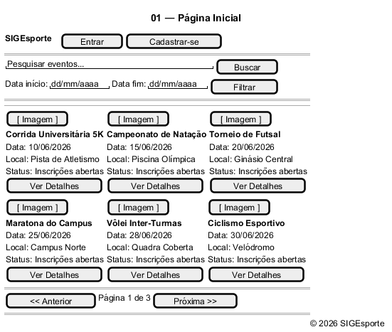

# Protótipos de Baixa Fidelidade (Wireframes)

Este documento reúne as telas do protótipo de baixa fidelidade do projeto, organizadas por módulos do sistema.

---

## 🌐 Geral

### Página Inicial

### Detalhes do Evento

---

## 🔐 Autenticação

### Login

### Cadastro

### Esqueci a Senha

---

## 🎓 Módulo: Aluno

### Perfil do Aluno

### Eventos Inscritos

### Editar Dados (Aluno)

---

## 🏢 Módulo: Organizador

### Perfil do Organizador

### Editar Dados (Organizador)

### Eventos Criados

### Detalhes do Evento (Visão Org)

### Criar ou Editar Evento

### Reservas de Espaço

### Nova Solicitação de Reserva

### Gerenciar Inscritos no Evento

### Organizações Vinculadas

### Editar Organização

---

## 💼 Módulo: Gestor

### Perfil do Gestor

### Editar Dados (Gestor)

### Gerenciar Espaços Esportivos

### Criar ou Editar Espaço Esportivo

### Aprovação de Reservas

### Gerenciar Usuários Administradores

